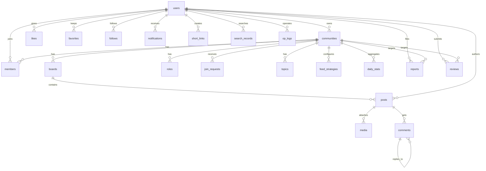

# 详细开发方案 —— dbs-curdeg（仿「腾讯频道」课设项目）

> 生成日期：2026-08-19 ｜ 依据文档：`课设技术栈推荐与实施方案.md`、`开发部署工作流方案.md`、`工作交接文档.md`、`research_cli_mcp_native_fields.md`、`research_tencent_channel_public.md`
> 本方案是**可执行的总纲**：把已定稿的技术栈、调研结论、部署链路整合为「每周做什么 → 具体任务 → 验收标准」的详细计划。
> 当前基线：部署链路已通（push → 3 分钟自动上线），**业务代码为零**，下一步开发账号系统。

---

## 一、项目总览

| 项 | 内容 |
|---|---|
| 项目名称 | dbs-curdeg 仿腾讯频道私域平台 |
| 交付形态 | Web（移动优先 H5 + PC 管理后台）+ Android App（Kotlin Compose）+ 共用 FastAPI API |
| 核心闭环 | 账号 → 频道 → 版块 → 发帖 → 评论/点赞 → 关注/加入 → 搜索 → 管理（RBAC）→ 通知 → AI |
| 亮点增量 | AI 帮写、内容巡检/AI 审核、RAG 问答机器人、运营看板 |
| 线上地址 | https://guild.weaxi.cn（push 即部署，最长 3 分钟生效） |
| 时间预算 | 8~10 周（按本方案第 12 节节奏执行） |

**成功验收口径（答辩前全部满足）**：
1. 账号闭环：注册 / 登录 / JWT / 个人资料可完整走通；
2. 内容闭环：建频道 → 加版块 → 发帖（富文本+图片）→ 评论楼中楼 → 点赞 → 关注，双端可用；
3. 治理闭环：身份组 RBAC + 删帖/置顶/精华/禁言/踢人，管理后台可用；
4. 通知闭环：WebSocket 实时推送 + 已读 + 分享短链；
5. AI 闭环：AI 帮写、内容巡检审核、问答机器人（RAG）三个功能可演示；
6. Android App 可独立安装，连同一套 API。

---

## 二、总体架构

### 2.1 架构决策（已定稿，勿改方向）

| # | 决策 | 理由 |
|---|---|---|
| D1 | **单体（Monolith）+ 模块化分层**，不做微服务 | 服务器实为 2C/3.5G，单体最省内存，答辩更好讲 |
| D2 | 前后端分离，**一套 REST/WebSocket API 双端复用** | Web 与 Android 成本最低的路线 |
| D3 | 数据库 **MySQL**（utf8mb4），JSON 字段存富文本分片；⚠️ **服务器实际为 MySQL 5.7**（库 guild / 用户 guild / 密码见 deploy/.env，IP 122.152.219.236），与 docker-compose.yml 的 mysql:8.0 不一致，需在阶段 0 确认版本并统一（见决策记录） | 中文课设最稳，FULLTEXT+ngram 支持中文搜索 |
| D4 | **Redis 7**：缓存热点 + Pub/Sub 通知 + 限流 + 简单任务队列 | 不引重型队列框架 |
| D5 | **AI 做后端内独立模块 `ai/`**，统一 LLM 网关（OpenAI 兼容协议）：**主模型 GLM-4.7-Flash（智谱免费）**，视觉审核 GLM-4.6V-Flash，**DeepSeek 兜底**，可切换 | 免费模型省成本，多模型接入答辩加分 |
| D6 | 认证 **JWT（access + refresh）+ bcrypt** | 简单可靠，预留 OAuth 接口 |
| D7 | 部署 **push 即上线**（服务器 cron 每 3 分钟拉取重建），GitHub Actions 只做测试 | 云镜黑名单禁止入站 SSH，见工作交接 §4 |
| D8 | 库表变更**只用 Alembic 迁移**，禁止手改生产库 | 可回滚、可追溯 |

### 2.2 部署架构（最终版）

```
本地 git push → GitHub（私有仓库 Dc-D666/dbs-curdeg）
                    ↑
服务器 cron（*/3 * * * *）→ /opt/channel/deploy/auto-deploy.sh
    ├─ git fetch origin main → 有变化才 reset --hard
    ├─ docker compose up -d --build → prune
    └─ 日志 /var/log/auto-deploy.log
```

容器编排（`deploy/docker-compose.yml`，已在线上运行）：
`web`(nginx: 静态前端 + 反代 `/api/`、`/healthz`、`/ws`、`/uploads/`、`/s/`，80/443) → `api`(FastAPI) + `mysql`(8.0) + `redis`(7)；阶段 6 起增加 `ai-worker`（同一 api 镜像、`command: python -m app.ai_worker`，消费 Redis 队列执行审核/统计任务）。

> ⚠️ **本方案新增的部署要点（当前 auto-deploy.sh 缺失）**：`api` 容器启动前必须执行 `alembic upgrade head`，否则新迁移永远不生效。落地方式（二选一）：
> - 推荐：改 `backend/Dockerfile` 入口为 `entrypoint.sh`（先 `alembic upgrade head` 再 `uvicorn`）；
> - 或：改 `auto-deploy.sh`，在 `up -d --build` 前执行 `docker compose run --rm api alembic upgrade head`。
> 详见第 10 节。

### 2.3 后端目录结构（目标态）

```
backend/
├── app/
│   ├── main.py                  # 入口：注册路由、中间件、生命周期
│   ├── core/                    # 配置/安全/工具
│   │   ├── config.py            # pydantic-settings 读取 .env
│   │   ├── security.py          # bcrypt 哈希、JWT 签发/校验
│   │   ├── deps.py              # 依赖注入：get_db / get_current_user / require_perms
│   │   └── response.py          # 统一响应 + 错误码
│   ├── models/                  # SQLAlchemy 2.x 模型（每个模块一个文件）
│   │   ├── user.py  community.py  board.py  role.py  member.py
│   │   ├── post.py  media.py   comment.py  like.py  topic.py
│   │   ├── follow.py favorite.py notification.py short_link.py
│   │   ├── review.py report.py search_record.py
│   │   └── ai_config.py system_config.py op_log.py stats.py
│   ├── schemas/                 # Pydantic 请求/响应模型（与 models 一一对应）
│   ├── api/                     # 路由层（只做参数校验与编排）
│   │   ├── v1/
│   │   │   ├── auth.py          # 注册/登录/刷新/登出/改密
│   │   │   ├── users.py         # 个人资料/他人主页/用户搜索
│   │   │   ├── communities.py   # 频道 CRUD/加入/退出/设置
│   │   │   ├── boards.py        # 版块 CRUD/排序/发帖权限配置
│   │   │   ├── roles.py         # 身份组 CRUD/权限点配置
│   │   │   ├── members.py       # 成员列表/审核/踢人/禁言/身份分配
│   │   │   ├── posts.py         # 发帖/编辑/删除/置顶/精华/审核/详情/流
│   │   │   ├── comments.py      # 评论/楼中楼/删评/评论点赞
│   │   │   ├── interact.py      # 点赞/收藏/关注/互动状态
│   │   │   ├── topics.py        # 话题 CRUD/关联帖子
│   │   │   ├── search.py        # 全文检索 + 高亮
│   │   │   ├── notifications.py # 通知列表/已读/设置
│   │   │   ├── shares.py        # 短链生成/解析
│   │   │   ├── uploads.py       # 图片/视频上传
│   │   │   ├── ai.py            # AI 帮写/审核/问答/摘要
│   │   │   ├── admin.py         # 看板统计/系统配置/操作日志
│   │   │   └── moderation.py    # 审核记录/举报
│   ├── services/                # 业务逻辑层（路由只调 service）
│   │   ├── auth_service.py  community_service.py  post_service.py
│   │   ├── feed_service.py  comment_service.py  member_service.py
│   │   ├── notify_service.py search_service.py  share_service.py
│   │   └── stats_service.py  review_service.py
│   ├── ai/                      # AI 模块
│   │   ├── llm_gateway.py       # OpenAI 兼容客户端（主 GLM-4.7-Flash，兜底 DeepSeek，视觉模型可切）
│   │   ├── assist.py            # AI 帮写/润色（SSE 流式）
│   │   ├── review.py            # 纯 AI 审核（无敏感词表）：小 maxtoken 快审 → 不通过可申诉 → 大 maxtoken+思维链复审
│   │   ├── rag.py               # 问答机器人（embedding + 召回 + 生成）
│   │   ├── summary.py           # 帖子/频道/周报摘要
│   │   └── prompts.py           # Prompt 模板集中管理
│   ├── ws/                      # WebSocket 通知
│   │   ├── manager.py           # 连接管理（user_id → connection）
│   │   └── events.py            # 事件类型定义 + 推送封装
│   ├── tasks/                   # 异步任务（Redis 简单队列）
│   │   ├── queue.py             # 入队/消费封装
│   │   ├── review_worker.py     # 审核任务消费
│   │   └── stats_worker.py      # 统计/摘要任务消费
│   └── ai_worker.py             # 独立 AI worker 进程入口
├── alembic/                     # 迁移脚本（versions/）
├── alembic.ini
├── entrypoint.sh                # 【新增】迁移 + 启动
├── requirements.txt
├── Dockerfile
├── pytest.ini / tests/          # 测试
└── .env.example
```

### 2.4 前端目录结构（目标态）

```
frontend/
├── src/
│   ├── main.ts  App.vue  router/  stores/(Pinia)  api/(axios 封装 + 模块接口)
│   ├── layouts/            # H5 移动布局 / Admin 管理布局
│   ├── views/
│   │   ├── h5/             # 移动端：首页流/频道页/帖子详情/发帖/评论/个人中心/通知
│   │   ├── auth/           # 登录/注册
│   │   └── admin/          # PC 管理后台：成员/内容/权限/看板/审核
│   ├── components/         # 富文本编辑器、图片九宫格、评论楼中楼、点赞等
│   ├── composables/        # useWebSocket / useInfiniteList 等
│   ├── utils/  types/  assets/
├── Dockerfile  nginx-web.conf  vite.config.ts  tsconfig.json
├── public/  manifest.webmanifest  icons/       # PWA：图标/清单（vite-plugin-pwa 生成）
└── .env.example            # VITE_API_BASE
```

### 2.5 Android 目录结构（目标态，`android/` 新建）

```
android/
├── app/src/main/java/com/curdeg/channel/
│   ├── MainActivity.kt             # 单 Activity + Compose Navigation
│   ├── data/                       # Retrofit API + DataStore + WebSocket 客户端
│   ├── ui/                         # Compose 页面：登录/首页流/频道/帖子/评论/发帖/通知/我的
│   ├── viewmodel/                  # MVVM ViewModel
│   └── util/  theme/
└── build.gradle.kts  settings.gradle.kts
```

---

## 三、技术栈明细（版本锁定）

| 层 | 选型 | 版本 | 备注 |
|---|---|---|---|
| 后端语言 | Python | 3.12 | slim 镜像 |
| Web 框架 | FastAPI | ≥0.115 | 原生 WebSocket |
| ORM | SQLAlchemy | 2.x | 2.0 风格（`Mapped`/`mapped_column`） |
| 迁移 | Alembic | 1.13+ | 全生命周期只用迁移 |
| 数据校验 | Pydantic | 2.x | 与 SQLAlchemy 模型分离（schemas/） |
| 数据库 | MySQL | 5.7（已确认） | utf8mb4；`innodb_buffer_pool_size=384M`、`max_connections=120`；⚠️ compose 需从 8.0 改回 5.7（见附录 A.2） |
| 缓存/队列 | Redis | 7 | appendonly |
| 认证 | python-jose + passlib[bcrypt] | bcrypt 锁 4.0.1 | access 30min + refresh 7d；见 requirements 注释（passlib/bcrypt 兼容） |
| 邮箱验证 | smtplib（标准库）+ QQMail SMTP | — | 注册邮箱验证码；SMTP 授权码见 deploy/.env（QQMail 已启用） |
| 上传 | python-multipart + 本地磁盘 | — | nginx 直服 `/uploads/` |
| 全文检索 | MySQL FULLTEXT + ngram parser | — | 中文分词，见 5.2 |
| LLM | openai SDK（兼容协议） | — | 主：GLM-4.7-Flash（智谱免费，api key `68c1…A5`）；兜底：DeepSeek（key `sk-d971…da6`）；图片审核：GLM-4.6V-Flash / GLM-4V-Flash |
| Web 前端 | Vue3 + Vite + TS | Vue 3.4 / Vite 5 | 现有骨架从 JS 升级为 TS |
| Web 状态 | Pinia | 2.x | 用户态/全局配置 |
| Web UI | Vant 4（H5）+ Element Plus（Admin） | 最新 | 双 UI 库按路由挂载 |
| Web 图表 | ECharts | 5.x | 看板 |
| PWA | vite-plugin-pwa | — | H5 打包成"类 App"体验（可安装桌面/离线），已确认要做 |
| Android | Kotlin + Jetpack Compose | Kotlin 2.x / Compose BOM；**minSdk 26 (Android 8.0)** | MVVM + Retrofit + OkHttp + Coil + DataStore + WS |
| 部署 | Docker Compose | v2 | nginx + api + mysql + redis |

**requirements.txt 目标（第 1 阶段就补全）**：
```
fastapi>=0.115,<1.0
uvicorn[standard]>=0.30,<1.0
pydantic>=2.7
pydantic-settings>=2.2
sqlalchemy>=2.0,<3.0
alembic>=1.13
pymysql>=1.1
redis>=5.0
python-jose[cryptography]>=3.3
passlib[bcrypt]>=1.7
bcrypt==4.0.1            # 锁版本：passlib 1.7.4 与 bcrypt>=4.1 有已知兼容报错（__about__ 属性缺失）
python-multipart>=0.0.9
openai>=1.40
httpx>=0.27
```

---

## 四、数据模型设计（核心交付物）

> 依据：`课设技术栈推荐与实施方案.md` §3（20 个业务域字段定义）+ `research_cli_mcp_native_fields.md`（原生字段对照，作为"对齐腾讯频道"的叙事素材）。
> 落地为 **23 张表**，完整覆盖 `课设技术栈推荐与实施方案.md` §3 的 **20 个业务域**（每域至少一张表，互动域拆 3 张，成员管理域另加 join_requests 辅助表），命名统一 `snake_case`，主键统一 `BIGINT AUTO_INCREMENT`，时间统一 `DATETIME`（UTC 存储，接口转北京时间），软删除统一 `is_deleted TINYINT(1)`。

### 4.1 表清单、业务域映射与关系

| # | 表名 | 对应业务域（文档 §3） | 建表阶段 |
|---|---|---|---|
| 1 | users | ① 用户与账号管理 | 阶段 1 |
| 2 | communities | ② 频道社区管理 | 阶段 2 |
| 3 | boards | ③ 版块分区管理 | 阶段 2 |
| 4 | roles | ④ 身份组与权限管理 | 阶段 2（结构）/ 5（权限实现） |
| 5 | members | ⑤ 社区成员管理 | 阶段 2 |
| 6 | join_requests | ⑤ 社区成员管理·加入审核（辅助表） | 阶段 2 |
| 7 | topics | ⑩ 话题标签管理 | 阶段 3 |
| 8 | posts | ⑥ 帖子主内容管理 | 阶段 3 |
| 9 | media | ⑦ 帖子媒体附件管理 | 阶段 3 |
| 10 | comments | ⑧ 评论与回复管理 | 阶段 3 |
| 11 | likes | ⑨ 互动行为·点赞 | 阶段 3 |
| 12 | favorites | ⑨ 互动行为·收藏 | 阶段 3 |
| 13 | follows | ⑨ 互动行为·关注 | 阶段 3 |
| 14 | feed_strategies | ⑮ Feed 流与排序管理 | 阶段 5 |
| 15 | notifications | ⑬ 通知消息管理 | 阶段 6 |
| 16 | short_links | ⑭ 分享与短链管理 | 阶段 6 |
| 17 | reviews | ⑪ 内容审核与巡检管理 | 阶段 6 |
| 18 | reports | ⑫ 举报申诉管理 | 阶段 7 |
| 19 | search_records | ⑯ 智能搜索管理 | 阶段 4 |
| 20 | ai_configs | ⑰ AI 能力配置管理 | 阶段 6 |
| 21 | system_configs | ⑳ 系统基础配置管理 | 阶段 1（种子数据） |
| 22 | op_logs | ⑱ 系统操作日志管理 | 阶段 4 |
| 23 | daily_stats | ⑲ 数据统计与看板管理 | 阶段 7 |

```
users（用户）
 ├─ 拥有 communities（频道）1─N boards（版块）｜ 1─N roles（身份组）｜ 1─N topics（话题）
 ├─ communities 1─N members（成员）─ users / roles（频道内身份）
 ├─ communities 1─N join_requests（加入申请）─ users
 ├─ boards 1─N posts（帖子）─ users(author) ─ media（附件）
 ├─ posts 1─N comments（评论，parent_id 楼中楼自关联）
 ├─ posts / comments N─N users via likes（点赞，多态目标）
 ├─ users N─N posts via favorites（收藏）｜ N─N users via follows（关注用户）
 ├─ users N─N communities via follows（关注频道）
 ├─ communities 1─1 feed_strategies（Feed 排序策略）
 ├─ notifications（通知）─ users ｜ short_links（短链）
 ├─ reviews（审核记录）/ reports（举报）─ users
 ├─ search_records（搜索记录）─ users
 ├─ ai_configs（AI 配置）/ system_configs（系统配置）
 └─ op_logs（操作日志）/ daily_stats（每日统计）
```

**ER 图（mermaid，答辩直接可用）**：



### 4.2 全量表字段定义（23 张，字段按文档 §3 逐域完整展开）

> 公共约定：每表含 `id BIGINT PK AUTO_INCREMENT`、`created_at`/`updated_at DATETIME`（部分表按需），不再重复列出。

**users（用户账号，阶段 1）** —— 文档①用户与账号管理
| 字段 | 类型 | 说明 |
|---|---|---|
| id | BIGINT PK | 用户 ID |
| username | VARCHAR(32) UNIQUE | 登录用户名 |
| password_hash | VARCHAR(128) | 加密登录密码（bcrypt） |
| nickname | VARCHAR(64) | 用户昵称 |
| avatar_url | VARCHAR(255) | 头像 URL |
| bio | VARCHAR(255) | 个人简介 |
| gender | TINYINT | 0未知 1男 2女 |
| province / city | VARCHAR(32) | 所在地（省/市，对应原生 location） |
| email | VARCHAR(64) | 绑定邮箱 |
| phone | VARCHAR(32) | 绑定手机号 |
| status | TINYINT | 0正常 1封禁 2注销 |
| user_type | TINYINT | 0普通 1系统管理员 2AI 虚拟账号（对应原生 uint32Type=2） |
| last_login_at / last_login_ip | DATETIME / VARCHAR(45) | 最后登录时间/IP |
| notify_settings | JSON | 通知开关配置（{mention,like,comment,follow,system,review,report} 逐类开关，对应文档⑬） |
| created_at / updated_at | DATETIME | 注册时间 / 更新时间 |

**communities（频道，阶段 2）** —— 文档②频道社区管理，对应原生 guild
| 字段 | 类型 | 说明 |
|---|---|---|
| id / number | BIGINT PK / VARCHAR(16) UNIQUE | 频道 ID / 频道唯一编号（对应 bytesGuildNumber） |
| name | VARCHAR(64) | 频道名称（对应 bytesGuildName） |
| profile | VARCHAR(255) | 频道简介（对应 bytesProfile） |
| avatar_url | VARCHAR(255) | 频道头像 URL |
| cover_url | VARCHAR(255) | 频道封面图 |
| member_count / post_count | INT | 成员总数 / 帖子累计数（冗余计数，缓存同步） |
| join_setting | TINYINT | 0自由加入 1审核加入 2邀请制 |
| visitor_interact_switch | TINYINT(1) | 访客互动总开关（对应 uint32VistorInteractionAllSwitch） |
| owner_id | BIGINT FK users | 频道所有者 ID |
| status | TINYINT | 0正常 1关闭 2违规封禁 |
| created_at / updated_at | DATETIME | 创建时间 / 最后更新时间 |

**boards（版块，阶段 2）** —— 文档③版块分区管理，对应原生 channel
| 字段 | 类型 | 说明 |
|---|---|---|
| id / community_id | BIGINT PK / FK communities | |
| name | VARCHAR(64) | 版块名称 |
| description | VARCHAR(255) | 版块描述 |
| sort | INT | 排序权重 |
| allow_post_role_ids | JSON | 允许发帖身份组（JSON 集合，对应 allow_roles） |
| allow_anonymous | TINYINT(1) | 是否允许匿名发帖 |
| status | TINYINT | 0正常 1隐藏 2关闭 |
| created_at / updated_at | DATETIME | |

**roles（身份组，阶段 2 建表）** —— 文档④身份组与权限管理，对应原生 role
| 字段 | 类型 | 说明 |
|---|---|---|
| id / community_id | BIGINT PK / FK communities | |
| name | VARCHAR(32) | 身份组名称 |
| color | VARCHAR(16) | 标识颜色 |
| level | INT | 等级权重 |
| perms | JSON | 权限点集合（发帖/评论/置顶/精华/删帖/禁言/踢人/成员管理/身份组管理/巡检/超管，见 4.3） |
| is_default | TINYINT(1) | 是否系统默认组（频道创建时自动建 owner/admin/normal） |

**members（成员，阶段 2）** —— 文档⑤社区成员管理，对应原生 member
| 字段 | 类型 | 说明 |
|---|---|---|
| id / community_id / user_id | BIGINT PK / FK / FK | 唯一约束(community_id, user_id) |
| role_id | BIGINT FK roles | 所属身份组 ID |
| nickname | VARCHAR(64) | 频道内专属昵称 |
| member_type | TINYINT | 0所有者 1管理员 2普通成员 3机器人 4AI（对应原生 uint32Type） |
| join_time | DATETIME | 加入时间 |
| join_channel | TINYINT | 0主动申请 1邀请加入 |
| shutup_expire_at | DATETIME | 禁言到期时间（NULL=未禁言，对应 modify_member_shut_up） |
| is_blocked | TINYINT(1) | 是否拉黑 |
| last_active_at | DATETIME | 最后活跃时间 |

**join_requests（加入申请，阶段 2）** —— 文档⑤社区成员管理的辅助表（审核加入制）
| 字段 | 类型 | 说明 |
|---|---|---|
| id | BIGINT PK | |
| community_id / user_id | BIGINT FK / FK | 唯一约束(community_id, user_id) 防重复申请 |
| status | TINYINT | 0待审核 1通过 2驳回 |
| handler_id | BIGINT FK users NULL | 审批人 ID |
| handled_at | DATETIME NULL | 审批时间 |
| created_at | DATETIME | 申请时间 |

**topics（话题，阶段 3）** —— 文档⑩话题标签管理，对应原生 topicContent
| 字段 | 类型 | 说明 |
|---|---|---|
| id / community_id | BIGINT PK / FK communities | |
| name | VARCHAR(32) | 话题名称 |
| description | VARCHAR(255) | 话题描述 |
| cover_url | VARCHAR(255) | 话题封面 |
| rules | VARCHAR(255) | 话题规则 |
| post_count | INT | 关联帖子数（冗余） |
| heat | INT | 热度值（话题热度排序用） |

**posts（帖子，阶段 3）** —— 文档⑥帖子主内容管理，对应原生 feed
| 字段 | 类型 | 说明 |
|---|---|---|
| id / community_id / board_id / author_id | BIGINT PK / FK×3 | |
| title | VARCHAR(128) | 帖子标题 |
| feed_type | TINYINT | 1普通 2图文 3视频 4投票 |
| rich_content | JSON | **富文本分片内容**（照抄原生 contents[].contents[]，见 4.4） |
| is_markdown | TINYINT(1) | 是否 Markdown（对应 isMarkdown） |
| source_markdown | MEDIUMTEXT | Markdown 源文本（对应 sourceMarkdown） |
| is_top / is_essence | TINYINT(1) | 置顶 / 精华（对应 top-feed / set-feed-essence） |
| view_count / comment_count / like_count / favorite_count / share_count | INT | 浏览/评论/点赞/收藏/分享计数 |
| status | TINYINT | 0正常 1待审核 2驳回 3已删除 |
| review_result | JSON NULL | AI 审核结论快照 |
| last_reply_at | DATETIME | 最后回复时间（Feed 排序用） |

**media（附件，阶段 3）** —— 文档⑦帖子媒体附件管理，对应原生 images/videos
| 字段 | 类型 | 说明 |
|---|---|---|
| id / post_id | BIGINT PK / FK posts | |
| media_type | TINYINT | 1图片 2视频 3文件 |
| url | VARCHAR(255) | 源文件 URL |
| thumb_url / cover_url | VARCHAR(255) | 缩略图 / 封面 URL |
| width / height | INT | 宽度 / 高度像素 |
| size | INT | 文件大小（字节） |
| duration | INT | 视频时长（秒） |
| level_urls | JSON NULL | 三档响应式 URL（对应 vecImageUrl levelType 1/2/3） |
| sort | INT | 排序序号 |

**comments（评论，阶段 3）** —— 文档⑧评论与回复管理，对应原生 comment
| 字段 | 类型 | 说明 |
|---|---|---|
| id / post_id / user_id | BIGINT PK / FK / FK | |
| parent_id | BIGINT FK NULL | 父评论 ID（NULL=顶层，楼中楼，对应 get_next_page_replies） |
| reply_to_id | BIGINT NULL | 被回复评论 ID |
| comment_type | TINYINT | 评论类型（0文字 1图片 2表情 3投票…） |
| content | TEXT | 评论内容 |
| like_count / reply_count | INT | 点赞数 / 回复数 |
| status | TINYINT | 0正常 1待审核 2违规删除 |
| ip_location | VARCHAR(64) | IP 属地 |

**likes（点赞，阶段 3）** —— 文档⑨互动行为
| 字段 | 类型 | 说明 |
|---|---|---|
| id | BIGINT PK | 记录 ID |
| target_type | TINYINT | 1帖子 2评论 |
| target_id | BIGINT | 目标 ID |
| user_id | BIGINT FK users | 点赞用户 ID |
| created_at | DATETIME | 点赞时间（唯一约束防重复） |

**favorites（收藏，阶段 3）** —— 文档⑨互动行为
| 字段 | 类型 | 说明 |
|---|---|---|
| id | BIGINT PK | 记录 ID |
| post_id | BIGINT FK posts | 目标帖子 ID |
| user_id | BIGINT FK users | 收藏用户 ID |
| group_name | VARCHAR(32) | 收藏分组 |
| created_at | DATETIME | 收藏时间（唯一约束防重复） |

**follows（关注，阶段 3）** —— 文档⑨互动行为
| 字段 | 类型 | 说明 |
|---|---|---|
| id | BIGINT PK | 记录 ID |
| follower_id | BIGINT FK users | 关注者 ID |
| target_type | TINYINT | 1用户 2频道 |
| target_id | BIGINT | 目标 ID |
| created_at | DATETIME | 关注时间（唯一约束防重复） |

**feed_strategies（Feed 排序策略，阶段 5）** —— 文档⑮Feed 流与排序管理
| 字段 | 类型 | 说明 |
|---|---|---|
| id / community_id | BIGINT PK / FK communities | 每频道一行策略配置 |
| sort_rule | TINYINT | 0最新发布 1热度排序 2精华优先 |
| weight_like / weight_comment / weight_favorite | INT | 热度权重配置（点赞/评论/收藏占比） |
| decay_hours | INT | 时间衰减系数 |
| top_weight | INT | 置顶帖权重 |
| cache_ttl | INT | 缓存有效期（秒） |

**notifications（通知，阶段 6）** —— 文档⑬通知消息管理
| 字段 | 类型 | 说明 |
|---|---|---|
| id / user_id | BIGINT PK / FK users | 接收用户 |
| type | VARCHAR(32) | 被@ / 被赞 / 新评论 / 新粉丝 / 系统通知 / 审核结果 / 举报反馈 |
| ref_id | BIGINT | 关联内容 ID |
| title | VARCHAR(128) | 通知标题 |
| summary | VARCHAR(255) | 内容摘要 |
| is_read | TINYINT(1) | 是否已读 |
| read_at | DATETIME NULL | 阅读时间 |

> 通知开关配置（文档⑬）不在此表逐行存储，放 `users.notify_settings JSON`（用户级一份，如 `{mention:true, like:true, comment:true, follow:true, system:true, review:true, report:true}`）。

**short_links（短链，阶段 6）** —— 文档⑭分享与短链管理
| 字段 | 类型 | 说明 |
|---|---|---|
| id | BIGINT PK | 短链 ID |
| code | VARCHAR(16) UNIQUE | 短链唯一编码 |
| target_type | TINYINT | 1频道 2帖子 3用户 |
| target_id | BIGINT | 关联目标 ID |
| creator_id | BIGINT FK users | 生成用户 ID |
| visit_count | INT | 累计访问次数 |
| expires_at | DATETIME NULL | 过期时间 |

> 实现细节：code 随机生成遇冲突重试；`visit_count` 计数走 Redis 防刷（同 IP 短时间多次访问去重/限速），定时落库；过期短链由每日任务清理。

**reviews（审核记录，阶段 6）** —— 文档⑪内容审核与巡检管理
| 字段 | 类型 | 说明 |
|---|---|---|
| id | BIGINT PK | 审核记录 ID |
| content_type | TINYINT | 1帖子 2评论 3用户资料 |
| content_id | BIGINT | 关联内容 ID |
| user_id | BIGINT FK users | 提交用户 ID |
| status | TINYINT | 0待审核 1通过 2驳回 |
| violation_type / violation_detail | VARCHAR(32) / VARCHAR(255) | 违规类型 / 违规详情 |
| review_method | TINYINT | 0AI 快审 1AI 复审(申诉) 2人工审核 |
| appeal_at | DATETIME NULL | 用户申诉时间（快审不通过后可申诉） |
| reviewer_id | BIGINT FK users NULL | 审核人 ID（人工复审时） |
| result | VARCHAR(255) | 处理结果（如"自动下架""驳回""人工复审"） |
| reviewed_at | DATETIME NULL | 审核时间 |

**reports（举报，阶段 7）** —— 文档⑫举报申诉管理
| 字段 | 类型 | 说明 |
|---|---|---|
| id | BIGINT PK | 举报 ID |
| report_type | TINYINT | 举报类型（0帖子 1评论 2用户 3频道） |
| target_type / target_id | TINYINT / BIGINT | 被举报内容 |
| reporter_id | BIGINT FK users | 举报人 ID |
| reason_category | VARCHAR(32) | 举报原因分类 |
| reason_detail | VARCHAR(255) | 举报详情 |
| evidence | JSON | 举证附件（URL 数组） |
| status | TINYINT | 0待处理 1处理中 2已办结 3驳回 |
| result | VARCHAR(255) | 处理结果 |
| handler_id | BIGINT FK users NULL | 处理人 ID |
| handled_at | DATETIME NULL | 办结时间 |

**search_records（搜索记录，阶段 4）** —— 文档⑯智能搜索管理
| 字段 | 类型 | 说明 |
|---|---|---|
| id | BIGINT PK | 搜索记录 ID |
| user_id | BIGINT FK users | 搜索用户 ID |
| keyword | VARCHAR(64) | 搜索关键词 |
| scope | TINYINT | 1帖子 2频道 3用户 4话题 |
| result_count | INT | 返回结果数 |
| created_at | DATETIME | 搜索时间 |

> 索引配置项（分词器 ngram、高亮字段、语义检索开关、向量模型参数）不单独建表，归入 `system_configs`（键如 `search.tokenizer=ngram`、`search.semantic.enabled`）。

**ai_configs（AI 能力配置，阶段 6）** —— 文档⑰AI 能力配置管理
| 字段 | 类型 | 说明 |
|---|---|---|
| id | BIGINT PK | 功能 ID |
| feature | VARCHAR(32) | 功能名（assist 帮写 / review 审核 / rag 问答 / summary 摘要） |
| enabled | TINYINT(1) | 启用状态 |
| model | VARCHAR(64) | 调用模型（deepseek-chat 等） |
| params | JSON | 模型参数（temperature / max_tokens） |
| prompt_template | TEXT | Prompt 模板 |
| rate_limit | INT | 调用频次上限 |
| billing_config | JSON NULL | 计费配置（可选） |

**system_configs（系统基础配置，阶段 1 种子数据）** —— 文档⑳系统基础配置管理
| 字段 | 类型 | 说明 |
|---|---|---|
| config_key | VARCHAR(64) PK | 配置键名 |
| config_value | TEXT | 配置键值 |
| description | VARCHAR(255) | 配置描述 |
| updated_at | DATETIME | 更新时间 |

> 覆盖：**站点名称=SDUdiscord、备案号=湘ICP备2026024339号-1**、上传大小限制、允许文件格式、AI 审核阈值、默认用户权限、搜索索引参数等。

**op_logs（操作日志，阶段 4）** —— 文档⑱系统操作日志管理
| 字段 | 类型 | 说明 |
|---|---|---|
| id | BIGINT PK | 日志 ID |
| operator_id | BIGINT FK users | 操作人 ID |
| action | VARCHAR(32) | 操作类型（新增/删除/修改/审核） |
| module | VARCHAR(32) | 所属模块 |
| detail | JSON | 操作详情 |
| ip | VARCHAR(45) | 操作 IP |
| request_params | JSON NULL | 请求参数 |
| response_result | JSON NULL | 响应结果 |
| created_at | DATETIME | 操作时间 |

**daily_stats（数据统计，阶段 7）** —— 文档⑲数据统计与看板管理
| 字段 | 类型 | 说明 |
|---|---|---|
| id | BIGINT PK | |
| stat_date | DATE | 统计周期（日；周/月由日数据聚合派生，不另建表；唯一约束 (stat_date, community_id) 防重复聚合） |
| community_id | BIGINT FK communities | 所属频道 ID |
| new_members / active_members | INT | 新增成员数 / 活跃成员数 |
| posts / interactions | INT | 帖子发布量 / 互动总量 |
| violations | INT | 违规内容数 |
| ai_calls | INT | AI 调用次数 |
| retention_rate | DECIMAL(5,2) NULL | 用户留存率（%） |

### 4.3 权限点清单（RBAC，对应原生治理层）

```
post.create 评论.create 置顶 精华 删帖 禁言 踢人 成员管理 身份组管理 内容巡检 超级管理员
```
实现：`roles.perms(JSON)` 存权限点集合 → `core/deps.require_perms(...)` 依赖注入统一校验（成员身份 → 身份组 → 权限点）。

### 4.4 富文本分片模型（帖子核心，照抄原生）

```jsonc
[ // posts.rich_content 示例
  { "type": 1, "text": "帮我写一个早睡文案" },
  { "type": 2, "at_user": { "id": 123, "nick": "南风来杏" } },   // @
  { "type": 3, "url": "https://…", "display_text": "链接标题", "url_type": 10 },
  { "type": 4, "emoji": { "id": "341", "pattern_id": "337" } },
  { "type": 8, "topic": { "topic_id": 12513, "topic_name": "#腾讯会议" } }
]
```
前端编辑器产出该结构，后端原样存 JSON，详情接口原样返回（双端共用同一契约）。

---

## 五、API 设计规范

### 5.1 统一约定
- 前缀：`/api/v1`；WebSocket：`/ws`（首帧发 auth 消息携带 token，不放 query，见 5.3）。
- 认证：`Authorization: Bearer <access_token>`；refresh 走 `/api/v1/auth/refresh`。
- 统一响应：`{ "code": 0, "message": "ok", "data": {...} }`；HTTP 状态码与 body `code` 并存（如 401+1001 token 失效、403+1002 无权限、2001 参数错误…，映射表见 `core/response.py`）。
- 分页：`GET ?page=1&page_size=20` → `{ "items": [...], "total": n, "page": 1, "page_size": 20 }`；长列表（评论/成员）支持游标分页（对应原生 bytesTransBuf）。
- 时间：一律返回北京时间字符串 `YYYY-MM-DD HH:mm:ss`。
- 文件上传：`POST /api/v1/uploads`（multipart），返回 `{ url, width, height, size }`。
- **唯一例外**：分享短链跳转 `GET /s/{code}` 走根路径（不挂 `/api/v1`），供未登录/外部用户打开，nginx 需单独反代 `/s/` 到 api。

### 5.2 检索方案（关键词 + 语义双路，已确认）
- 建表时对 `posts.title`、`posts.source_markdown` 建 `FULLTEXT INDEX`（`WITH PARSER ngram`，`ngram_token_size=2`）。⚠️ ngram 需 MySQL 5.7.6+，阶段 0 确认生产库版本时一并验证。
- 关键词路：FULLTEXT 检索帖子/频道/用户/话题，返回 `highlight_words`（对应原生 highlightWords）与命中片段。
- 语义路：帖子 embedding（API）存 `posts.embedding JSON`，应用层余弦相似度召回 TopK，与关键词结果融合排序（对应原生 aiSearchInfo）。
- 记录 `search_records`（热门搜索词统计）。

### 5.3 WebSocket 协议
```
客户端 → 服务端：{ "type": "auth", "token": "<access_token>" }
服务端 → 客户端：{ "type": "notification", "data": { "id", "type", "title", "summary", "ref_id", "created_at" } }
服务端 → 客户端：{ "type": "pong" }（心跳 30s）
```
- 未认证连接 10s 断开；断线重连用 refresh token 重新走 auth。
- 通知事件：`@mention / like / comment / follow / system / review_result / report_feedback`。

### 5.4 关键端点清单（第 1~8 周逐步实现，合计约 75 个）

| 模块 | 端点 |
|---|---|
| auth | POST /auth/register, /auth/login, /auth/refresh, /auth/logout, PUT /auth/password |
| users | GET/PUT /users/me, GET /users/{id}, GET /users/{id}/posts |
| communities | POST /communities, GET /communities, GET /communities/{id}, PUT /communities/{id}, DELETE /communities/{id}(owner), POST /communities/{id}/join, POST /communities/{id}/leave, PUT /communities/{id}/settings(owner) |
| boards | POST /communities/{cid}/boards, GET /communities/{cid}/boards, PUT /boards/{id}, DELETE /boards/{id}, PUT /boards/{id}/sort |
| roles | POST/GET/PUT/DELETE /communities/{cid}/roles, PUT /roles/{id}/perms |
| members | GET /communities/{cid}/members, POST /communities/{cid}/members/{uid}/role, POST /members/{id}/shutup, DELETE /members/{id}(kick), GET /communities/{cid}/join-requests(审核加入) |
| posts | POST /communities/{cid}/boards/{bid}/posts, GET /posts/{id}, GET /posts/{id}/related, PUT /posts/{id}, DELETE /posts/{id}, POST /posts/{id}/top, POST /posts/{id}/essence, POST /posts/{id}/review, GET /communities/{cid}/feed?sort=hot|latest|essence |
| comments | POST /posts/{id}/comments, POST /comments/{id}/replies, GET /posts/{id}/comments, GET /comments/{id}/replies, DELETE /comments/{id}, POST /comments/{id}/like |
| interact | POST/DELETE /likes, POST/DELETE /favorites, POST/DELETE /follows, GET /me/interactions |
| topics | CRUD /communities/{cid}/topics, POST /posts/{id}/topics |
| search | GET /search?q=&scope=post|community|user|topic |
| notifications | GET /notifications, POST /notifications/read, POST /notifications/read-all, PUT /notifications/settings |
| shares | POST /shares, GET /s/{code}(跳转；根路径例外，见 5.1) |
| uploads | POST /uploads |
| ai | POST /ai/assist(SSE 流式), POST /ai/review, POST /ai/qa, POST /ai/summary |
| admin | GET /admin/stats, GET /admin/reviews, GET /admin/reports, POST /admin/reviews/{id}/handle, PUT /admin/configs, GET /admin/logs |
| moderation | POST /reports, GET /me/reports |

---

## 六、分阶段开发计划（详细到任务与验收）

> 节奏原则：**每个阶段结束 = 能 push 上线 = 在 https://guild.weaxi.cn 实时验收**。每完成一个功能即提交推送（提交规范见第 13 节）。

### 阶段 0（第 0 天，一次性基建加固）—— 先修地基再盖楼

**任务清单**：
- [ ] 后端补全 `requirements.txt`（第 3 节清单）并本地安装
- [ ] 初始化 Alembic：`alembic init` → 配置 `sqlalchemy.url` 读环境变量 → 建 `alembic/versions/`
- [ ] 新建 `app/core/config.py`（pydantic-settings，从环境变量读 `MYSQL_*`、`REDIS_*`、`JWT_SECRET`、`ZHIPU_API_KEY`、`DEEPSEEK_API_KEY`、`SMTP_*` 等）+ `backend/.env.example`
- [ ] **确认生产 MySQL 版本**：`ssh_exec` 122.152.219.236 执行 `mysql -V` / `docker exec <mysql容器> mysql -V`，核对 5.7 vs compose 8.0 差异（决定 FULLTEXT ngram 可用性与字符集行为），并统一 deploy/.env 与 compose
- [ ] 新建 `app/models/__init__.py`（集中导入所有模型，供 Alembic autogenerate 发现）+ `app/db.py`（engine / SessionLocal / Base）
- [ ] `entrypoint.sh`（`alembic upgrade head` → `uvicorn`），改 Dockerfile CMD；同步改 `auto-deploy.sh` 无需动（入口内完成迁移）
- [ ] 前端骨架升级 TypeScript：`vite.config.ts` + `tsconfig.json` + 迁移现有 `.vue/.js`，引入 Pinia、axios、vue-router
- [ ] PWA 接入：`vite-plugin-pwa` + manifest + 图标（可安装"类 App"体验，已确认要做）
- [ ] 前端 API 封装：`src/api/http.ts`（axios 实例 + 401 自动刷新 token **单飞 single-flight**（并发 401 只发一次 refresh，其余请求排队等待）+ 统一响应解包）
- [ ] `.github/workflows/deploy.yml` 冒烟测试升级为 `pytest` 跑起来（先加一个真测试）

**验收标准**：
1. 本地 `alembic upgrade head` 能在 MySQL 建出空库结构（有 `alembic_version` 表）；
2. push 后线上自动构建成功，`/healthz` 返回 ok，且日志确认 entrypoint 执行了迁移；
3. 前端 `npm run build`（TS 编译）通过，页面正常。

### 阶段 1（第 1 周）：账号系统 + 通用基础

**任务清单**：
- [ ] `app/models/user.py`（4.2 users 表）+ Alembic 首个迁移 `alembic revision --autogenerate -m "create users"`
- [ ] `app/schemas/user.py`（RegisterRequest / LoginRequest / TokenResponse / UserOut / UpdateProfileRequest）
- [ ] `app/core/security.py`：bcrypt 哈希 + `create_access_token`(30min) / `create_refresh_token`(7d) / `decode_token`
- [ ] `app/core/deps.py`：`get_db`、`get_current_user`（从 Bearer 解析）
- [ ] `app/services/auth_service.py` + `app/api/v1/auth.py`：注册（用户名唯一、密码强度）、登录（失败限速）、刷新、登出（refresh 加入 Redis 黑名单）、改密
- [ ] `app/services/user_service.py` + `app/api/v1/users.py`：资料查看/编辑、他人主页
- [ ] 注册/登录页（H5）：表单校验、token 持久化、自动登录
- [ ] 邮箱验证码：`email_service.py`（smtplib + QQMail SMTP）+ 注册流程「填邮箱 → 收验证码 → 验证后注册」，验证码 Redis 缓存 5 分钟
- [ ] 个人中心页（H5）：资料展示/编辑、头像上传（阶段 1 先实现最小 `uploads.py`：仅图片、类型/大小校验、返回 url；阶段 3 再扩展图片/视频 + level_urls）
- [ ] pytest：`tests/test_auth.py`（注册/登录/刷新/越权）

**验收标准**：
1. 双端（Web + curl）注册（邮箱验证码）→ 登录 → 拿 token → 改资料 → 刷新 token 全链路通；
2. 错误密码 5 次触发限流；重复用户名/邮箱注册返回明确错误码；验证码错误/过期被拒；
3. `GET /users/me` 未带 token 返回 401；带他人 token 无法改他人资料；
4. 线上可注册真实账号并登录。

### 阶段 2（第 2 周）：频道 + 版块 + 成员（含加入审核）

**任务清单**：
- [ ] models：`community.py` / `board.py` / `role.py` / `member.py` + 迁移（roles 提前到本阶段建表，频道创建时自动初始化 owner/admin/normal 默认组）
- [ ] `community_service.py` + `communities.py`：创建（自动成为 owner 成员）、列表（含我加入的/公开的）、详情、编辑、解散（仅 owner）
- [ ] `board_service.py` + `boards.py`：CRUD、排序、隐藏/关闭
- [ ] `member_service.py` + `members.py`：加入（自由/审核/邀请三种方式）、退出、成员列表（按身份组分页）
- [ ] 加入审核：新建 `join_requests` 表（申请用户/频道/状态/审批人），owner 审批通过后自动建 members 记录
- [ ] 前端：频道发现/创建页、频道详情页（版块 tab）、加入/退出按钮
- [ ] pytest：频道创建权限、版块 CRUD、三种加入方式

**验收标准**：
1. 创建频道 → 自动成为成员并出现在"我的频道"；
2. 审核制频道：申请加入 → owner 审批 → 通过后才可发帖；
3. 非 owner 编辑频道/版块返回 1002 无权限；
4. 线上可完整演示建频道、加版块。

### 阶段 3（第 3~4 周）：发帖 + 评论 + 点赞 + 关注 + 帖子流（核心内容闭环）

**任务清单**：
- [ ] models：`post.py` / `media.py` / `comment.py` / `like.py` / `follow.py` / `favorite.py` / `topic.py` + 迁移（含 FULLTEXT 索引）
- [ ] `uploads.py`：图片/视频上传（校验类型与大小、生成缩略图可选、返回三档 level_urls）
- [ ] `post_service.py` + `posts.py`：发帖（rich_content JSON + media 关联）、编辑（本人）、删除（本人/版主）、详情（含作者/频道/版块信息 + 互动状态）、审核状态流转
- [ ] 富文本编辑器（前端）：**以现成编辑器为内核（如 wangEditor/TipTap）做深度定制**——自定义分片序列化（产出 4.4 结构）+ 主题美化（不直接用默认样式），支持文本/@/链接/图片/话题 分片编辑
- [ ] `feed_service.py`：`GET /communities/{cid}/feed` —— 阶段 3 先做「置顶 → 精华 → 最新」；**热度排序收敛到阶段 5**（feed_strategies + Redis 热度缓存），避免重复返工；游标分页
- [ ] `comment_service.py` + `comments.py`：顶层评论 + 楼中楼回复（parent_id）+ 评论点赞 + 删除（本人/版主）
- [ ] `interact.py`：点赞/取消、收藏/取消、关注用户/频道/取消
- [ ] 前端：帖子流（无限滚动）、帖子详情（评论楼中楼展开）、发帖页、互动按钮
- [ ] 草稿箱（可选加分项，对应公开调研"QQ 9.9.32 支持频道独立草稿箱"）：编辑器自动保存草稿，按频道隔离
- [ ] pytest：发帖权限（版块 allow_post_role_ids）、评论嵌套、点赞幂等（唯一约束）、Feed 排序正确性

**验收标准**：
1. 图片上传 → 帖子图文混排 → 详情展示三级图；
2. 评论/楼中楼/点赞全链路，重复点赞不重复计数；
3. Feed 排序正确：置顶恒在顶部、精华优先、最新在前（热度排序阶段 5 验收）；
4. 关注频道后"我关注的"流可拉取。

### 阶段 4（第 5 周）：身份组 RBAC + 管理动作 + 搜索

**任务清单**：
- [ ] models：`role.py` 权限字段完善 + `search_record.py` / `op_log.py` + 迁移；`core/deps.require_perms()` 权限校验器（成员→身份组→perms）
- [ ] `roles.py`：身份组 CRUD、权限点配置、默认组初始化（复用阶段 2 的默认组）
- [ ] 管理动作接口：置顶、加精、删帖（他人）、禁言、踢人、拉黑、成员身份分配 —— 全部走 `require_perms`
- [ ] `search_service.py` + `search.py`：**关键词(FULLTEXT+ngram) + 语义(embedding 余弦)双路召回融合**，返回高亮词；热门搜索词统计
- [ ] 前端管理后台（PC/Element Plus）：频道概览、成员管理（禁言/踢人/身份）、内容管理（删帖/置顶/精华）、身份组配置
- [ ] pytest：权限矩阵用例（每权限点：有/无/越级）

**验收标准**：
1. 管理员能置顶/删他人帖，普通成员不能（返回 1002）；
2. 禁言到期自动解除（shutup_expire_at 校验）；被踢/拉黑成员无法再进频道发帖；
3. 中文关键词能搜到帖子并带高亮词；
4. 管理后台可用，所有操作有 op_logs 留痕。

### 阶段 5（第 6 周）：通知（WS）+ 分享短链 + Feed 热度

**任务清单**：
- [ ] models：`notification.py` / `short_link.py` / `feed_strategy.py` + 迁移
- [ ] `ws/manager.py`：连接注册（token→user_id）、心跳、断线清理；`ws/events.py` 推送封装
- [ ] `notify_service.py`：@/点赞/评论/关注/系统/审核结果 事件 → 落库 + WS 推送
- [ ] `notifications.py`：列表、单条已读、全部已读、通知设置
- [ ] `share_service.py` + `shares.py`：短链生成（随机 code）/解析跳转/访问计数
- [ ] Feed 热度算法：`score = like*1 + comment*2 + favorite*3 + 时间衰减(指数)`；`feed_strategies` 表按频道配置权重与缓存，Redis 缓存热点
- [ ] 前端：通知中心页 + 顶部角标（WS 实时）+ 分享按钮复制短链；Admin 通知开关
- [ ] pytest：WS 认证/推送/断线、短链生成解析

**验收标准**：
1. A 评论 B 的帖子 → B 页面**不刷新**收到角标+通知（WS 验证）；
2. 短链 `https://guild.weaxi.cn/s/xxxx` 可跳转帖子，计数+1；
3. 热度 Feed 与最新 Feed 排序结果可区分。

### 阶段 6（第 7 周）：AI 一期 —— 帮写 + 巡检审核 + 问答机器人

**任务清单**：
- [ ] `ai/llm_gateway.py`：openai SDK 兼容客户端，**主模型 GLM-4.7-Flash**（base_url/api_key 从 .env），统一 `chat()` / `stream()` / `embed()` / `vision()` 接口，**DeepSeek 兜底**，模型可配置
- [ ] `tasks/queue.py`：Redis 简单队列（list push/brpop）+ 消费循环
- [ ] `ai/assist.py` + `POST /ai/assist`：**SSE 流式**帮写/润色（按频道风格），前端编辑器"AI 帮写"按钮接入
- [ ] `ai/review.py`：**纯 AI 审核（不建敏感词表，省 token）**——① 发帖异步入队，小 `max_tokens` 快审，仅「通过/不通过」二态；② 不通过时用户可**申诉** → 大 `max_tokens` 复审（可选启用思维链）→ 驳回 / 人工复审 / 通过三态；③ 命中自动下架，申诉流程落 `reviews` 表
- [ ] models：`review.py` / `ai_config.py` + 迁移（审核记录表、AI 功能配置表，阶段 7 举报闭环复用 reviews）
- [ ] `tasks/review_worker.py` + `ai_worker.py`：独立进程消费审核任务；compose 增加 `ai-worker` 服务（同镜像不同 command）
- [ ] `ai/rag.py` + `POST /ai/qa`：帖子切分 → embedding（**GLM Embedding-3，API**）→ embedding 存 `posts` 的 JSON 数组列（**MySQL 5.7/8 均无 VECTOR 类型**，应用层余弦相似度召回，课设规模足够）→ TopK → GLM 带引用回答
- [ ] 前端：编辑器 AI 按钮（流式打字机效果）、问答机器人聊天浮窗
- [ ] pytest：网关 mock 测试、审核队列端到端（mock LLM）、RAG 召回

**验收标准**：
1. 编辑器点"AI 帮写"出现流式输出并可一键插入正文；
2. 发帖触发 AI 快审：疑似违规被自动下架；被下架用户可申诉 → 复审给出驳回/人工复审/通过；
3. 问答机器人能基于频道帖子内容回答并附引用；
4. 发帖请求不被 AI 审核阻塞（异步队列生效）。

### 阶段 7（第 8 周）：AI 二期 + 数据看板 + 安全加固

**任务清单**：
- [ ] `ai/summary.py`：帖子摘要、频道运营周报（统计 + LLM 生成），`daily_stats` 每日聚合任务
- [ ] AI 角色频道助手：`member_type=4` 虚拟成员，可被 @ 触发问答（对应原生 uint32Type=2）
- [ ] AI 绘画入口：编辑器"文生图"按钮 → **CogView-3-Flash**（智谱文生图 API）→ 生成图回填帖子
- [ ] 种子数据：演示账号（普通用户 + 管理员）+ 示例频道/版块/帖子/评论（`seed.py` 脚本，幂等可重跑）
- [ ] 站点品牌配置：`system_configs` 写入站点名 **SDUdiscord**、备案号 **湘ICP备2026024339号-1**（页脚展示）、上传限制等
- [ ] models：`report.py` / `daily_stat.py` + 迁移（举报表、每日统计表）
- [ ] `admin.py` 看板：ECharts 数据大屏（成员增长/活跃/发帖/互动/AI 调用）
- [ ] `reports.py` 举报闭环：提交举报 → 处理 → 反馈通知
- [ ] 安全加固：全局限流（Redis，按 IP/用户）、SQL 注入自查（全部走 ORM）、越权测试、上传文件类型白名单 + 随机文件名、**CORS 收紧**：`allow_origins=["*"]` 与 `allow_credentials=True` 不能共存（浏览器带凭据拒绝通配源），改为明确前端域名列表 + 凭据二选一
- [ ] 生产配置收口：`deploy/.env` 增补 `JWT_SECRET`、`DEEPSEEK_API_KEY` 等；`.env.example` 同步
- [ ] pytest 全量回归 + 性能冒烟（并发 50 请求 p95 < 500ms）

**验收标准**：
1. 看板显示真实统计数据；周报可一键生成；
2. 举报 → 处理 → 通知闭环走通；
3. 限流生效（超频返回 429）；越权攻击用例全部被拒；
4. 全量 pytest 通过，线上无回归。

### 阶段 8（第 9~10 周）：Android App + 答辩材料

**任务清单**：
- [ ] Android 工程初始化：单 Activity + Compose Navigation + 主题（**minSdk 26**，targetSdk 最新稳定版）
- [ ] `data/`：Retrofit API 接口（对应后端全部端点）+ TokenStore(DataStore) + WebSocket 客户端
- [ ] 页面（按优先级）：登录/注册 → 首页帖子流 → 频道列表 → 帖子详情（富文本/图片/评论）→ 发帖（含 AI 帮写）→ 通知（WS 角标）→ 我的
- [ ] 双端联调：同一账号 Web 发帖 App 可见、点赞互相同步
- [ ] 答辩材料：架构图、ER 图、API 文档（FastAPI 自动 OpenAPI 导出）、演示脚本、PPT、README 完善
- [ ] 课设报告：需求分析 / 系统设计 / 核心实现 / 测试 / 总结

**验收标准**：
1. APK 可安装，核心闭环在 App 内可完整走通；
2. OpenAPI 文档（/docs）导出为双端契约附录；
3. 答辩叙事 3 句话（对标/技术/AI）有真实演示支撑。

---

## 七、AI 功能排期总表

| 优先级 | 功能 | 阶段 | 实现要点 | 模型 |
|---|---|---|---|---|
| ★★★ | AI 帮写/润色 | 6 | SSE 流式，频道风格 Prompt | GLM-4.7-Flash（兜底 DeepSeek） |
| ★★★ | 内容巡检 + AI 审核 | 6 | 纯 AI：小 max_tokens 快审（通过/不通过）→ 申诉大 max_tokens+思维链复审 | GLM-4.7-Flash；图片 GLM-4.6V-Flash |
| ★★★ | 问答机器人（RAG） | 6~7 | 切分→embedding(API)→召回→带引用回答 | GLM-4.7-Flash + embedding API |
| ★★☆ | 帖子/频道/周报摘要 | 7 | LLM 生成 + 看板 | GLM-4.7-Flash |
| ★★☆ | 语义搜索 | 4~5 | 关键词(FULLTEXT+ngram) + embedding 语义召回双路 | embedding API |
| ★☆☆ | AI 角色频道助手 | 7 | member_type=4 虚拟成员，可 @ 触发 | GLM-4.7-Flash |
| ★☆☆ | AI 绘画入口 | 7 | 接绘图 API（CogView-3-Flash），编辑器"文生图" | CogView-3-Flash |

> 架构红线：AI 调用全部走**异步任务队列**（Redis + 1 个 worker 进程），不阻塞请求线程；LLM 是外部 API，2C/3.5G 完全扛得住。
> 模型策略：**GLM-4.7-Flash 免费模型为主**（省 token），DeepSeek 兜底降级；视觉审核用 GLM-4.6V-Flash / GLM-4V-Flash。两个 API Key 均放入 `deploy/.env`（`ZHIPU_API_KEY` / `DEEPSEEK_API_KEY`），不入库。

---

## 八、双端分工与联调节奏

| 阶段 | Web（H5 + Admin） | Android | 联调 |
|---|---|---|---|
| 1 | 账号系统页 | —（可先搭工程骨架与 API 接口层） | OpenAPI 契约先行 |
| 2 | 频道/版块基础页 | 工程骨架 + 登录页 | API 契约对齐 |
| 3~4 | 帖子流/发帖/评论 | 首页流 + 详情页 | 同一账号数据互通 |
| 5 | 管理后台全量 | 发帖 + 互动 | 权限场景 |
| 6~7 | 通知 + AI 全量 | 通知 + AI 帮写 | WS 实时性 |
| 8~10 | 看板 + 收尾 | 全功能收口 | 答辩演示脚本 |

> Android 工程骨架在阶段 2 启动，**阶段 3 起并行开发**（不阻塞后端），最终阶段 8 收口 —— 比原方案"第 9~10 周才做 Android"更稳妥。

---

## 九、测试与质量保障

| 层级 | 内容 | 工具 | 时机 |
|---|---|---|---|
| 单元测试 | services 层业务逻辑（计数、状态机、权限矩阵） | pytest | 随阶段（**全量 TDD：端点必有测试**） |
| API 测试 | 端点入参/越权/认证/错误码 | pytest + httpx TestClient | 随阶段（全量） |
| 集成测试 | DB（事务回滚 fixture）+ Redis（假队列） | pytest | 每阶段末 |
| AI mock | LLM 调用全部 mock（`openai` 客户端注入假响应） | pytest | 阶段 6~7 |
| 前端 | 关键页冒烟（可先不做单测，答辩可讲取舍） | vitest（可选） | 阶段 8 |
| CI | push 后 GitHub Actions 跑 pytest 冒烟 | deploy.yml | 每次 push |
| 安全 | 越权矩阵用例、限流、上传白名单 | 手动 + pytest | 阶段 7 |
| 性能 | 并发 50 冒烟、SQL 慢查询日志检查 | locust(可选)/EXPLAIN | 阶段 7 |

**测试目录约定**：`backend/tests/{unit,api,integration}/`，`conftest.py` 提供独立测试库（Docker 起的 MySQL 测试实例，**不用 in-memory**——它不支持 JSON/FULLTEXT/事务回滚语义）+ 每测试事务回滚 fixture。已确认**全量 TDD**：每个端点/核心 service 必配测试，未配测试的功能不 push。

---

## 十、部署与运维（push 即上线，重点修订）

### 10.1 上线流程（每次 push 自动执行）
```
git push → GitHub（私有仓库）
  → 服务器 cron（≤3min）→ auto-deploy.sh
      1. git fetch + 检测变化
      2. git reset --hard（生产代码=仓库 HEAD）
      3. docker compose up -d --build
      4. 【api 容器 entrypoint】alembic upgrade head（迁移自动执行，本方案新增）
      5. docker image prune -f
  → https://guild.weaxi.cn 验收
```

### 10.2 数据库迁移上线纪律（重点）
1. **迁移只前向**：新字段用可空列/默认值，禁止破坏性变更（DROP/改类型），保证回滚安全；
2. **迁移执行位置**：`entrypoint.sh`（容器启动时 `alembic upgrade head`），改表即生效；
3. **回滚**：`alembic downgrade -1`（手动 SSH 操作，生产库变更需谨慎，先备份）；
4. **禁止手改生产库**：任何变更必须走 migration 文件并提交。

### 10.3 备份
- 新增 cron：每日 `mysqldump channel > /opt/channel/backup/channel_$(date +%F).sql`，保留 7 天；
- `uploads` 卷随备份（或每日 rsync 到 backup 目录）；
- 答辩前手动全量备份一次。

### 10.4 运维速查（继承工作交接 §7）
```bash
bash /opt/channel/deploy/auto-deploy.sh   # 手动触发一次
tail -20 /var/log/auto-deploy.log          # 部署日志
docker compose -f /opt/channel/deploy/docker-compose.yml ps
docker compose -f /opt/channel/deploy/docker-compose.yml logs api --tail 50
```

### 10.5 已知风险红线（勿踩，来自工作交接 §8）
- 云镜黑名单：禁止任何 GitHub/Azure→服务器入站方案；
- 推送必须开代理（127.0.0.1:7897），否则 push 失败；
- DNS 记录用 A 记录（DNSPod 选"显性URL"不生效）；
- `.env` 不入库；服务器实为 2C/3.5G，AI worker + 大并发时注意内存。

---

## 十一、风险与应对

| 风险 | 影响 | 应对 |
|---|---|---|
| 服务器 2C/3.5G 内存吃紧 | 大并发/多 worker 卡顿 | uvicorn 1~2 worker；MySQL buffer pool 384M；Redis 精简；AI worker 1 个；可向腾讯云确认升配 |
| 时间风险：AI/Android 工作量大 | 答辩前做不完 | 按优先级裁切：AI 保 3 个 ★★★，Android 保核心闭环；每周阶段验收 |
| 迁移炸库 | 线上不可用 | 只前向迁移、可空列、部署前本地 `alembic upgrade head` 演练 |
| 富文本结构复杂度 | 编辑器/双端展示不一致 | 前端编辑器与后端 JSON 契约先定死（4.4），详情接口原样返回 |
| 代理未开导致推送失败 | 部署中断 | 推送前检查 7897；失败先查网络再查代码 |
| AI API Key 额度/限流 | 功能演示失败 | 网关统一管理 + 限流 + mock 测试兜底；答辩备降级文案 |
| 双端数据一致性 | 验收穿帮 | 联调阶段用同一账号实测跨端互动 |

---

## 十二、里程碑与交付物

| 周 | 里程碑 | 可演示点（线上验收） |
|---|---|---|
| 0 | 基建加固（迁移/TS/入口脚本） | /healthz + alembic_version 存在 |
| 1 | 账号系统上线 | 注册/登录/改资料 |
| 2 | 频道/版块/成员 | 建频道、加版块、三种加入方式 |
| 3~4 | 内容闭环 | 发帖（富文本+图）、评论楼中楼、点赞、关注、Feed |
| 5 | 治理与搜索 | 管理后台 RBAC、禁言/踢人/置顶/精华、中文搜索 |
| 6 | 通知/短链/热度 | WS 实时角标、短链跳转、热度 Feed |
| 7 | AI 一期 | 帮写（流式）、审核、问答机器人 |
| 8 | AI 二期 + 看板 + 加固 | 运营周报、看板、限流/越权防护 |
| 9~10 | Android + 答辩 | APK 全闭环、OpenAPI 契约、PPT/报告 |

**最终交付物清单**：线上站点（Web）+ APK + 源码仓库（含全部文档）+ OpenAPI 接口文档 + 课设报告 + 答辩 PPT + 演示脚本。

---

## 十三、开发纪律

1. **git**：只用一个 `main` 分支；提交规范 `feat: 发帖功能` / `fix: 评论楼中楼 bug` / `docs: 接口文档`；每功能可运行再 push（push 即上线）；
2. **密钥**：`.env` 系列永远不入库；新增配置先加 `.env.example`；
3. **数据库**：一切变更走 Alembic；本地先 `upgrade head` 验证再 push；
4. **文档同步**：接口/表结构变化后，及时更新本方案与 README（`开发部署工作流方案.md` 的部署章节仍为旧方案，本次已由本文档 §10 覆盖，勿再引用其部署部分）；
5. **每周节奏**：周初领任务 → 周中开发+自测 → 周末 push + 线上验收 + 更新文档；
6. **答辩叙事**（3 句话）：对标腾讯频道产品结构 → 单体 FastAPI+MySQL/Redis+WS 双端一套 API + RBAC → 统一 LLM 网关（GLM 主 + DeepSeek 兜底）落地帮写/巡检/问答/摘要。

---

## 附录 A：用户决策记录（2026-08-19 确认）> 本附录固化开发前用户拍板的全部决策，后续开发**以此为准**；标 ⚠️ 的为待确认项。

### A.1 范围与时间
- **工期**：8~10 周全量执行，不压缩。
- **Android**：完整核心闭环（登录/帖子流/详情/发帖含 AI 帮写/评论/通知/我的），阶段 2 骨架启动、阶段 3 起并行，minSdk 26。
- **Web**：移动优先 H5 + PC 管理后台双端，**PWA 做成"类 App"体验**（vite-plugin-pwa + 可安装）。

### A.2 数据库与检索（已确认）
- **生产库**：服务器 122.152.219.236 上的 MySQL **5.7**（已确认，非 8.0），库 `guild`、用户 `guild`、密码在 `deploy/.env`（仅放服务器）。
- **⚠️ compose 需同步**：`deploy/docker-compose.yml` 当前写 `mysql:8.0`，与实际 5.7 不符 —— 阶段 0 将 compose 改为 `mysql:5.7` 并实测 `SELECT VERSION()` + 验证 ngram FULLTEXT 可用性（需 5.7.6+）。
- **检索**：关键词（FULLTEXT+ngram）+ 语义（embedding 余弦）**双路融合**，不做 ES。

### A.3 AI 模型策略
- **主模型**：智谱 **GLM-4.7-Flash（免费）**，api key `68c1b48b…A5`（`ZHIPU_API_KEY`）。
- **兜底**：DeepSeek，key `sk-d971…da6`（`DEEPSEEK_API_KEY`）—— LLM 网关统一 `chat()/stream()/embed()/vision()`，模型可切换。
- **图片审核**：GLM-4.6V-Flash / GLM-4V-Flash（视觉模型）。
- **AI 绘画**：**CogView-3-Flash**（智谱文生图，阶段 7 接入）。
- **embedding**：**GLM Embedding-3**（API）。
- **AI 范围**：全量 —— 帮写 + 内容巡检审核 + 问答机器人(RAG) + 摘要/周报 + AI 频道助手 + AI 绘画入口。
- Key 一律只进 `deploy/.env` / 服务器，不入库；`backend/.env.example` 只留占位。

### A.4 账号与注册
- **注册**：邮箱验证码（QQMail SMTP 已启用，发件人 **3303188265@qq.com**，授权码在 `deploy/.env`，`SMTP_*` 配置），验证码 Redis 缓存 5 分钟。
- **不做** QQ OAuth（内部账号即可）。

### A.5 内容治理（纯 AI 审核，已确认）
- **不建敏感词表**（省 token）：发帖异步小 `max_tokens` 快审，仅「通过/不通过」；命中自动下架。
- **申诉机制**：不通过 → 用户可申诉 → 大 `max_tokens` 复审（可开思维链）→ 驳回 / 人工复审 / 通过三态；落 `reviews` 表（已加 `appeal_at` 字段）。**"人工复审"由系统管理员在后台处理**（超管权限点，见 A.5）。

### A.6 内容与前端
- **编辑器**：现成编辑器（wangEditor/TipTap）内核 + 深度定制（分片序列化 + 主题美化，不用默认样式）。
- **Markdown**：双模式（富文本 + Markdown 源码，对应 is_markdown/source_markdown）。
- **UI**：H5 用 Vant 4，管理后台用 Element Plus，双库。
- **种子数据**：需要（演示账号 + 示例频道/版块/帖子，`seed.py` 幂等）。
- **🎨 去 AI 味视觉规范（前端所有页面强制执行）**：
  - 主色：单一品牌蓝 `#1a73e8`，**禁用蓝紫渐变按钮/横幅**；
  - 圆角分面：按钮 8px / 卡片 10px / 弹层 14px；不"卡片套卡片"；
  - 分割：优先 1px `#e8e8e8` 细线分割，阴影仅用于浮层（弹窗/Dropdown）；
  - 排版：左对齐，字号阶梯 13/15/17/20，行高 1.6，禁止居中大标题+副标题的 landing 味；
  - 文案：直述式（"发帖""管理成员""通知"），禁"解锁/赋能/轻松搞定/一键"式营销词；
  - 状态完备：骨架屏/空状态/错误态/加载态四态齐全，不只有成功态；
  - 图标统一线性图标，界面元素禁用 emoji；
  - 间距用 4/8/12/16/24 token 体系。
  - 落地：前端 `src/styles/tokens.css` 统一 token；评审时逐页对照此规范。

### A.7 品牌与部署
- **站点名**：SDUdiscord（山东大学课设，不刻意塞入山大元素）。
- **备案号**：湘ICP备2026024339号-1（页脚展示）。
- **域名**：单域名 `guild.weaxi.cn` 路径反代（/api /ws /uploads /s），不拆子域名。
- **服务器**：先按 2C/3.5G 开发，不升配。

### A.8 测试与验收
- **测试**：全量 TDD（每端点/核心 service 必配测试，未配不 push）。
- **验收**：push 即线上验收，不另出周报；答辩前 OpenAPI 契约 + APK + 报告/PPT。

### A.9 待确认清单（已全部确认 ✅）
| # | 确认结果 | 影响 |
|---|---|---|
| 1 | ✅ 生产 MySQL **5.7**（compose 同步为 mysql:5.7，阶段 0 实测 VERSION + ngram） | ngram 需 5.7.6+ |
| 2 | ✅ AI 绘画用 **CogView-3-Flash**（智谱） | 阶段 7 文生图 |
| 3 | ✅ embedding 用 **GLM Embedding-3**（API） | 阶段 4/6 语义检索 + RAG |
| 4 | ✅ QQMail 发件人 **3303188265@qq.com**（授权码在 deploy/.env） | 阶段 1 邮箱验证码 |
| 5 | ✅ 申诉"人工复审"由**系统管理员**（超管权限）后台处理 | 阶段 5~7 权限设计 |

---

## 附录 B：本方案与既有文档的关系

| 文档 | 与本方案关系 |
|---|---|
| `课设技术栈推荐与实施方案.md` | 技术栈与数据模型的**权威来源**，本方案 §3/§4 直接引用 |
| `开发部署工作流方案.md` | 工作流参考；其部署章节（Actions SSH）已被工作交接 §8 废弃，本方案 §10 为最新口径 |
| `工作交接文档.md` | 当前状态基线 + 红线清单，本方案全面继承 |
| `research_cli_mcp_native_fields.md` / `research_tencent_channel_public.md` | 调研证据，供答辩引用；数据模型与 AI 功能对标出处 |
